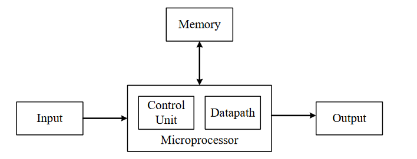
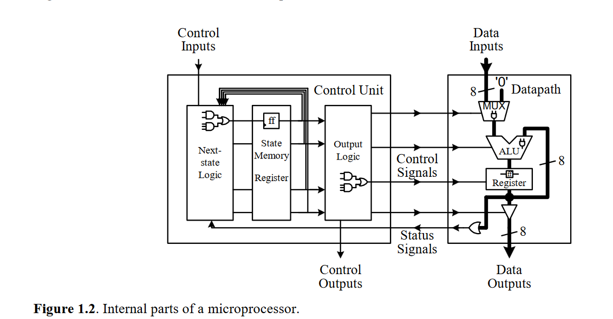

# Overview

This book is aims to teach how microprocessors work and HDL. The book starts with all the fundementals of digital design until the high level stuff like datapaths, control units, dedicated micrdoprocessors and general purpose microprocessors.

Below is the summary of the book.

# Folder structure

1. [Examples](examples)
2. [Exercises](exercises)

# Summary

## Chapter one

 

### Overview

 

This chapter serves as an overview of the book's goal (designing microprocessors) and the structure of the book.

If you have assembled a PC before, you probably bought memory sticks, CPU, motherboard, video card ....etc and made a PC but you don't understand how a computer work at the circuit level. In this book we take a look inside the ICs that make up a computer like how the memory is designed and how the CPU is designed.

This book teaches how to design Microprocessors from ground up. Microprocessors are in the heart of any smart devices which are capable of making decision and controls. Those microprocessors are inside your car, TV... and even a greeting card.

There are two types of Microprocessors: general purpose microprocessors and dedicated microprocessors. General purpose microprocessors can perform different tasks depending on the control of the software instructions meanwhile dedicated microprocessors perform one specific task. Dedicated microprocessors are called ASIC and they are being used in a lot of application like the Anti Lock system in the Car breaks, Microwave ovens and lots of application.

General purpose Microprocessors are powerful and they are being used in personal computers. This book will provide the fundamentals to understand how CPUs are designed.

 

### Overview of a microprocessor

 

The Von Neumann model of a computer (as shown below) consists of memory, IO, and a Microprocessor. All the parts that you see in a computer fall under on of those categories. The monitor and speaker for example are IO, the ROM, RAM, and Hard drive are memory and all of that beside the CPU which is a Microprocessor.

  

 

As we are going to design microprocessors we will take a look inside the internals that make up one. A microprocessor (as shown below) consists of two major parts : datapath and control unit. The datapath is responsible for the actual execution of all data operations inside the microprocessor like the addition of two numbers inside the ALU. The datapath consists of functional units like ALU for arithmetic operations, registers for temporary storage, multiplexers for data source selections and datalines that passes the data from one functional unit to another.

 

  

 

Even though the datapath is capable of executing all the microprocessor operations through its functional units, it can not do it alone. A controller is needed to control the movement of the data and the execution order in the datapath. The controller is a Finite State Machine because it performs the control over the dapath by going from a state to another where there are a finite number of states.

 

