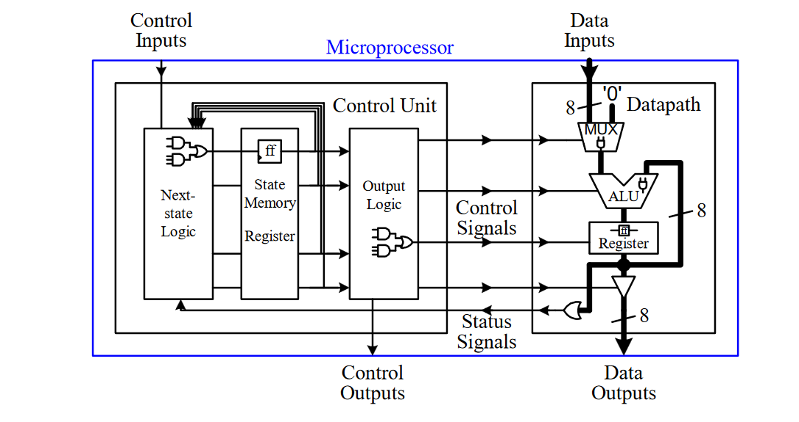

# Overview

This book is aims to teach how microprocessors work and HDL. The book starts with all the fundementals of digital design until the high level stuff like datapaths, control units, dedicated micrdoprocessors and general purpose microprocessors.

Below is the summary of the book.

# Folder structure

1. [Examples](examples)
2. [Exercises](exercises)

# Summary

## Chapter one
### overview
This chapter serves as an overview of the book's goal (designing microprocessors) and the structure of the book.

If you have assembled a PC before, you probably bought memory sticks, CPU, motherboard, video card ....etc and made a PC but you don't understand how a computer work at the circuit level. In this book we take a look inside the ICs that make up a computer like how the memory is designed and how the CPU is designed.

This book teaches how to design Microprocessors from ground up. Microprocessors are in the heart of any smart devices which are capable of making decision and controls. Those microprocessors are inside your car, TV... and even a greeting card.

There are two types of Microprocessors: general purpose microprocessors and dedicated microprocessors. General purpose microprocessors can perform different tasks depending on the control of the software instructions meanwhile dedicated microprocessors perform on